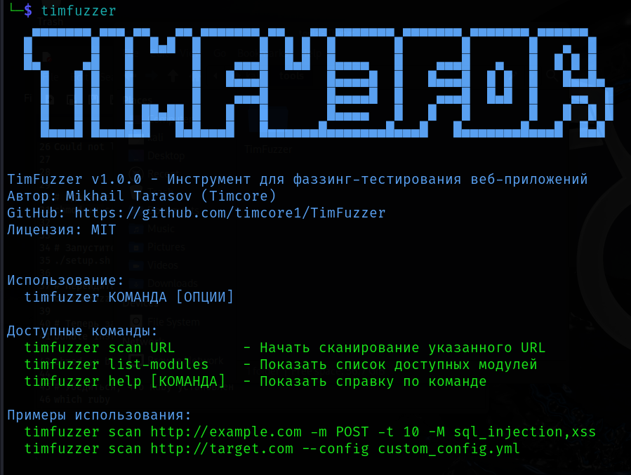

# TimFuzzer

 

 
 

TimFuzzer — это мощный инструмент для фаззинг-тестирования веб-приложений, написанный на Ruby. Он предназначен для автоматического тестирования веб-приложений на наличие различных уязвимостей.

## 🚀 Возможности
- **Множество типов уязвимостей:**
 - SQL-инъекции
 - Cross-Site Scripting (XSS)
 - Local File Inclusion (LFI)
 - Command Injection

   
 **Многопоточное сканирование**
 
 **Подробные отчеты в JSON формате**
 
 **Гибкая настройка через YAML конфигурацию**
 
 **Модульная архитектура**
 
## 📋 Требования

- Ruby 2.7+
 RubyGems
 Bundler

## 💻 Установка

Обновляем систему

`sudo apt update`

`sudo apt upgrade -y`

Устанавливаем необходимые пакеты

`sudo apt install -y ruby ruby-dev ruby-bundler git build-essential`

Клонируем репозиторий

`git clone https://github.com/timcore1/TimFuzzer.git`

`cd TimFuzzer`

Настраиваем инструмент

`chmod +x setup.sh`

`./setup.sh`

Устанавливаем зависимости

`cd timfuzzer`
bundle install
